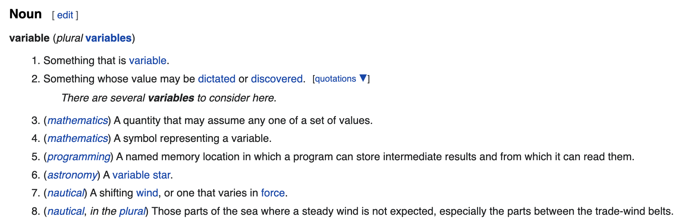

## Table of Contents
1. [Variables in Python](#variables)
2. [Python keywords](#keywords)
3. [Strings](#strings)
4. [Basic Operations with Strings](#stringoperations)
5. [String Immutability](#stringsimmutability)
6. [String Methods](#stringmethods)
7. [Formated Strings](#fstrings)
8. [Comparing Strings](#comparingstrings)
9. [Numbers](#numbers)
10. [Number Comparison](#ncomparison)
11. [Operations with Numbers](#numbersoperations)
12. [Printing Numbers](#printnumbers)
13. [Numbers vs. Strings](#numbervsstring)
14. [References](#references)


## Variables in Python <a name="variables"></a>



https://en.wiktionary.org/wiki/variable#Noun

Variables in python follow definition #5 here. They are named spots where we can store some information. For example, 


```python
num_students = 10
```

The above line of python code creates a variable named *num_students*, and stores the value *10* in that variable.
Sometimes in this course we will divide up into breakout rooms to work on activities in small groups.
If we wanted a python program to calculate an appropriate number of breakout rooms, it might be helpful to have a variable that stores the number of students in a session.


It can be helpful to think of a variable as a labeled box that we can store something in, where the label can tell us about what's in the box.
The label (name) is just to help the programmer and others look at the code to understand what the code is doing. Python doesn't understand the meaning of variable names!
Note that a variable name like *x* can be much less informative than a name like *num_students*.


We can always change what's stored in a python variable. Let's say we have new information about how many students have joined the class.
The following code tells python to store the value 12 in *num_students*. This value will replace whatever value was there originally (in this case, 10).

```python
num_students = 12
```


By the way, when we want to put information into a variable, the variable name always goes on the left. This won't work:

```python
12 = num_students
```


This is a good place to take a moment and look at how PyCharm shows information about variables and what is in them.


Storing some value in a variable is only useful if we have a way of then using that value.
The simplest way of "using" a value is just asking Python to output its value. For this, we use the *print* function:

```python
print(num_students)
```

Here's another way of using this variable. Let's say we want to have at most 4 students per breakout session, and we want to know how many breakout sessions we should have:

```python
num_breakouts = num_students/4
print(num_breakouts)
```


We'll talk more about printing and format strings later, but for now here's an example of how to use *print* to display a more informative message:

```python
print(f"The suggested number of breakouts is: {num_breakouts}")
```


Note that the computer needs to know that a variable exists before using it:

```python
print(num_day_of_class)
```


Python places some limitations on variable names:
+ May include letters, numbers and underscores (but a variable name cannot start with a number)
+ Spaces are not allowed
+ Do not use Python **keywords** as variable names
+ Do not use **dots** or other "punctuation"


Invalid names for variables include
```python
a.1 = 5.0
a 1 = 5.0
print = 4.0
```

Make sure to try these lines and see what kind of errors you get!

### Python Keywords <a name="keywords"></a>

The following English words must not be used as variable name

**and, as, break, class, continue, def, del, elif, else, except, exec, finally, for, from, global, if, import, in, is, lambda, not, or, pass, print, raise, return, try,
while, with, yield**

## Strings in Python <a name="strings"></a>

*Strings* are sequences of alphanumeric characters. Some of these characters can "whitespace", or blank characters
that wouldn't look like much on their own, but are useful for formatting (e.g., spaces, new-lines, etc.)
They start and end with either a single quotation mark or double quotation mark.

```python
my_string1='biomedical informatics'
my_string2="python bootcamp"
```

```python
empty_string  = ""
string_with_just_space = " "
string_with_just_spaces = "     "
```


One of the things we can ask Python to do with strings is tell us their length. 
The length of a string is the number of characters in the sequence that makes up the string.


```python
print(len(my_string1))
print(len(my_string2))
```

These lines will just display numbers representing the lengths of the respective strings. 
We can make these more informative:

```python
print(f"mystring_1 is the name of a variable that currently stores a string value, and the length of that string is: {len(my_string1))}")
print(f"mystring_2 is the name of a variable that currently stores a string value, and the length of that string is: {len(my_string2))}")
```

Because strings are represented in Python as sequences of letters/characters, we can access specific locations within that sequence,
for example to get the first character in a string.

> In Python, first elements of a string, list, etc. **start at the zeroth location**

```python
print(my_string1[0])
```

```python
print(my_string1[5])
```

We can also form **slices** or parts of a string that themselves consist of one or more characters:

```python
print(my_string2[3:])
```
Or going in the reverse order

```python
print(my_string2[-2])
```


### Other oerations with strings <a name="stringoperations"></a>

One basic operation with strings is **concatenation**, which means pasting together two strings.


```python
my_string3 = my_string1 + my_string2
```
Note that this doesn't modify either of the original strings.

How many strings are concatenated together by the following line of code?

```python
my_string3 = mystring1 + ":" + my_string2
```

We can also **repeat** concatenating strings

```python
my_string4= 3 * "epizeuxis"
```

### Immutability and Special characters<a name="stringsimmutability"></a>

Strings in Python are *immutable*, which means that once created a string cannot be changed.

```python
topic_name = "python"
```
The above line creates a string and stores it in a variable:


If we made a mistake creating this string and realize we want it to start with "P" rather than "p", we might be tempted
to just replace the "p" with an "P":


If Python did allow this, it might look something like this:

```python
topic_name[0] = 'P'
```

But that code produces an error!

What we have to do instead is create an entire new string, which can then be stored in the same variable:


```python
topic_name = "Python"
```

This can be a confusing point, but we will discuss it more later when we talk about other kinds of sequences, some of which are immutable and some of which are mutable.


Internally, computers identify characters by assigning them a number. For example, the following lists ASCII (American Standard Code for Information Interchange) codes. ASCII is one of the first widely-used standards for encoding alphbetical characters in computers using numbers.


source:wikipedia


Python uses [unicode](https://en.wikipedia.org/wiki/List_of_Unicode_characters) characters, which go well beyond the ASCII range.

```python
unexpected_truth="I'm awake in this class " +chr(189)+" of the time" +"\n"+ "the other " +chr(190)+ " I'm checking my instagram account"
print(unexpected_truth)
```

### String Methods <a name="stringmethods"></a>

A method is an action in Python that we can perform on a string or other object.

Usually the type of an object determines what kind of methods it supports.
For example, Python knows that it has a built-in method for converting a string to uppercase:

```python
drug_name="  HydrOXYzine "
print(drug_name.upper())
```

However, it wouldn't make any sense to convert a number to uppercase, and Python knows this:

```python
my_num = 5
print(my_num.upper())
```


Here are some other string methods.
Note that each time we call a method and print the result, *Python is producng this output without changing what is stored in the variable*

```python
print(drug_name.rstrip())
print(drug_name.lstrip())
print(drug_name.replace("OXY","oxy"))
print(drug_name)
```

### Format strings (fstrings) <a name="fstrings"></a>

We've already had a preview of format strings. They allow us to produce output that intersperses variables with strings of characters:

```python
my_school="UAMS"
my_location="Little Rock"
where_am_I=f"{my_school} in {my_location}"
print(f"{my_school} is in {my_location.upper()}")
```

### Comparison of Strings <a name="comparingstrings"></a>

We can use the use *==* symbol or *!=* symbol to determine whether the strings are the same or not. 

```python
print('Lidocaine 0.5%'== 'lidocaine 0.5%')
print(' OxycoDONE (Immediate Release)'== 'OxycoDONE (Immediate Release)')
```

## Numbers in Python <a name="numbers"></a>

A quick recall of college algebra

Integers are whole numbers: ...,-3,-2,-1,0,1,2,3,...
A rational number is the ratio (quotient) of two integers p/q where q>0.
A real number (floating point) is a quatity x=n+0.d1d2... where di's are digits between 0 and 9 (do not have infinite number of 9's)


```python
a=3
b=4
```

We can use the basic arithmetic operations

```python
a+1
a-2
```

The division is a little bit odd, but let's see

```python
print(a/2+b)
print(a//2 +b)
```


### Number comparison <a name="ncomparison"></a>

When we compare two numbers, say 3>2, we obtain a **logical value** (True or False)

```python
3<4
```

Now, we can add some logic

```python
3<4 and 8<9
```
Other logic comparisons are

```python
1!=2 or 3>4
```

> Funny fact. In 1993, Sunsoft had a *priority one*  bug report that was holding up the sale of $20 million worth hardware. 
> The problem was the following line

```python
x=2  # this was suppose to be the correct line
x==2 # but this was typed instead 
```


### Other basic operations <a name="numbersoperations"></a>

Power function
```python
a=2
a**4
```
Sum of a sequnce of numbers:
```python
sum([1, 2, 3, 4, 5, 6])
```

> Even larger computers cannot hold an infinite amount of numbers. So we have only an **approximation** of those numbers.

```python
0.1+0.1+0.1-0.3
```
### Printing Numbers <a name="printnumbers"></a>

We can print numbers with specific format

```python
my_pi=3.141592653589793
print("%.2f"%my_pi) ## The old way to have the number rounded 2 decimal places
print("{0:.2f}".format(my_py)) ## The pythonistic way
print("%E" % my_pi)
```

### Numbers vs Strings <a name="numbervsstring"></a>

Let's suppose you have the code

```python
uams_zip="UAMS zip code is" + 72205
```
This produces an error, because **integers(or floats) ARE NOT strings**

If we want to combine numbers and strings, we can ask Python nicely to treat a number as if it were a string:

```python
uams_zip="UAMS zip code is " + str(72205)
```

Or, if we have a string that looks like a number (this happens more than you'd expect), we can ask Python to convert it to a number:

```python
a= int('75')+3
b=float('3e2')+0.9
c=float('7,399.05')+0.07 #this is a trouble line
print(a+b+c)
```
Correct the previous code so you can obtain the printed value.


## References <a name="references"></a>

1. [Python Crashcourse](https://www.amazon.com/Python-Crash-Course-Eric-Matthes/dp/1718502702) E. Matthes. Third Edition. No starch press (2019)
2. [Rapid GUI Programming with Python and Qt](http://www.amazon.com/Programming-Python-Prentice-Software-Development/dp/0132354187/ref=sr_1_3?crid=3HIAT02B1BFAT&dchild=1&keywords=rapid+gui+programming+with+python+and+qt&qid=1626355927&sprefix=rapid+gui+p%2Caps%2C184&sr=8-3) M. Summerfield. Prentice Hall. (2007)
3. [Learning Python](http://www.amazon.com/Learning-Python-5th-Mark-Lutz/dp/1449355730/ref=sr_1_3?dchild=1&keywords=learning+python+lutz&qid=1626356046&sr=8-3) M. Lutz. Fourth Edition. O'Reilly (2023)

