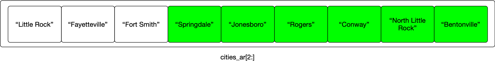

## Table of Contents
1. [Lists in Python](#list)
2. [Manipulating Lists](#manipulation)
3. [Useful Methods for Lists](#methods)
6. [Lists are Sequences](#sequences)
7. [In-class Exercise](#exercise)
5. [Copying a List](#listcopy)
8. [References](#references)


## Lists in Python <a name="list"></a>

A **list** is an ordered collection of items. It can be defined using *square brackets* and listing items to include in the list, separated by commas.

```python
my_list=["a",'b','c']           # a list containing three strings
my_list1=["a",'b','3']          # another list containing three strings
my_list2=["a",'b',3]            # a list containing two strings and something else 
my_list3=[1,1,2,3,5,8,13,21]    # a list containing only numbers
```

As with strings, the first element of a list is at position 0:

```python
print(my_list[0])
```


Since my first element is a **string**, then we can use some of the methods that we've learned

```python
print(my_list[0].upper())
```

### Manipulating Lists <a name="manipulation"></a>

Lists are **MUTABLE**, which means that we can change what is in a list, for example by assiging something new to replace the element at position 0 in a list.

```python
my_list[0] = 'c'
print(my_list)
```

Recall that when we tried to do something like this to modify a *string* last time, it produced an error because strings are not mutable.


Let's play with a list of cities in Arkansas. 

```python
cities_ar=['Little Rock',
           'Fayetteville',
           'Fort Smith', 
           'Springdale', 
           'Jonesboro', 
           'Rogers', 
           'Conway',
           'North Little Rock',
           'Bentonville']
```

This is not a comprehensive list. Some nearby cities missing from this list include Pine Bluff and Hot Springs.


Here is the situation after we run that line of code:


*cities_ar* is a variable ("named storage container"). It is storing an entire list. This list happens to contain only strings, but as we've seen above,
lists can contain mixed data.

If we want to get one element out of that list, we can use the name of the variable and an index:

```python
cities_ar[3]
```


Since this structure a sequence (list) of other sequences (strings), it might even make sense to use two indices.
For example, to get the first letter (#0) of the name of the fourth city (#3) in the list:

```python
cities_ar[3][0]
```


Just as we can slice subsequences of characters out of strings, we can also slice parts of lists:

```python
cities_ar[2:]
```




### Useful Methods for *Lists*  <a name="methods"></a>

Suppose the name of your list is L

| Method | Description |
|-------|--------|
| len(L) | length of the list L |
|L.append(y) | Adds the item y at the end of the list |
|L.extend(m) | Adds the list m at the end of the list L |
|L.remove(y) | Removes the item y from the list L|
|L.pop() | Removes the last item from the list L|
|L.index(y) | Returns the index position of the leftmost occurence of the item y in list L|
| x in L | Returns True if item x is in list L|
| x not in L | Returns True if item x is not in list L|
|L.sort()| Sorts the list|
|L.reverse() | Reverses list L |

Many of these work for other types of sequences as well (like strings).


## Lists are Sequences <a name="sequences"></a>


As discussed above, a **list** in Python is an ordered collection of values:

```python
list_of_numbers = [15, 22, 38, 54, 66, 3]
list_of_strings = ["Biomedical", "Informatics", "Python" "Bootcamp"]
mixed_list = [2025, "Bootcamp", 3.14159]
```

Python includes other **sequence** types as well. The **string** type is on example we have already seen.

```python
example_string = "Today is Thursday, July 10, 2025, and we are learning Python"
```

One of the things that different types of sequences have in common is that we can get their length using the function **len**:

```python
print(f"The length of example_string is: {len(example_string)}")
print(f"The length of list_of_numbers is: {len(list_of_numbers)}")
```

**Remember**: the names we choose for variables can (should) tell us something about what's going to be stored in the variable or what it is going to be used for, as in *example\_string* and *list\_of\_numbers*. But it's important to remember that these names mean nothing to Python. We could just as well call a list of numbers *x* or *example\_string*, and Python would treat them exactly the same way. Variable names are for us to keep track of what's going on.


Another similarity you will have noticed is that we can access individual elements of both strings and lists using an index value with '[' and ']':

```python
print(f"The first element in list_of_strings is {list_of_strings[0]}")
print(f"The first element in example_string is {example_string[0]}")
```

We will also soon take a look at another type of Python sequence called a **tuple**.


## 2025 Summer Python Programming Bootcamp - In-class Exercise 1 <a name="exercise"></a>
========

### Introduction
For this in-class exercise, we will divide up into breakout groups of 2-4 students. One student in each group will volunteer to "drive" PyCharm, and the group will
work together on the exercise outlined below. There is no submission step for this exercise, but we will bring the groups together to discuss the exercise at the end. One student from each group should be prepared to share the group's work with the rest of the class.


### Exercise


Let's say we have some patient demographic data from an electronic health record stored in a tabular format, where each row in the table has information for a single patient, and each column in the table has a distinct feature of the patient's record. For example, in the table below the first row is about a patient named Edgar Hermann. The first column in the table holds MRNs (medical record numbers); the last column holds patients' zip codes; and so on.

**NOTE** This is made up ("synthetic") example data. These are not real people, social security numbers, etc.


| MRN | BIRTHYEAR | SSN | FIRST | LAST | ZIP |
| -----| -----| -----| -----| -----| -----|
| 7182 | 1989 | 999-76-5071 | Edgar | Hermann | 72034 |
| 7491 | 2018 | 999-92-3312 | Dionna | Heathcote | 72411 |
| 7052 | 2013 | 999-80-4418 | Eleni | Gusikowski | 72736 |
| 4851 | 2011 | 999-51-6410 | Ricardo | Mills | 72046 |
| 1744 | 1969 | 999-72-5953 | Michelle | Breitenberg | 72472 |


#### Task 1: Make a list
By copying and pasting elements of this table into PyCharm, create a single list that encodes all the information from a single row in this table. Store this list in a variable called **pat_data1**. So for example, if a group picks the fourth row in this table, the list they build in these step should include Ricardo Mills' MRN, birth year, SSN, etc. You will have to make some choices about which of these elements should be strings and which should be numbers.

Make sure you can print out this list. Make sure you can print individual elements (e.g. just the SSN field) from this list.

#### Task 2: More lists
Create two more lists like the above but for different rows in the table. Put all three of your patient data lists into a list of lists called **patients**. This should be a list with three elements in it, each of which it itself a list of strings and numbers.

#### Task 3: Use the list
Write one or more lines of python code that uses the information in your list to print out a message with a patient's full name and year of birth.
For example, if we want to print this information for Dionna Heathcote, the print statement should produce the following output:

```python
Dionna Heathcote was born in 2018
```

#### Task 4: Modify your list
Imagine that one of your patients moves and their zip code is now 72205. How can you update your **patients** list to reflect this change without recreating the list?


**End of the exercise**


## Modifying Lists in Variables  <a name="listcopy"></a>

What happens when we have a list in a variable and we want another copy of it?
The following code creates a new variable (*covid variants*)  and assigns it to contain a list.
It then creates another variable (*who variants*) and assigns it to the same value as *covid variants*.
Let's explore what this does:

```python
covid_variants = ['Beta', 'Gamma', 'Delta', 'Alpha']
who_variants = covid_variants
print(who_variants)
print(covid_variants)
```
Let's replace the *Alpha* variant with *Alpha with E484K*

First we locate where the *Alpha* variant is and replace with the new value.
Then we'll take a look at what is in each variable.

```python
print(who_variants.index('Alpha')) # this line will locate the position of the Alpha 

who_variants[who_variants.index('Alpha')] = 'Alpha with E484K'
```

Now let's look at our two variables, _covid\_variants_ and _who\_variants_

```python
print(who_variants)
print(covid_variants)

```

*Is the output what you expected to see?*


What is happening here? To save memory, by default Python doesn't want to create more lists than it needs to.
This is where the "variables are boxes to put things in" analogy weakens a bit.
In he below fragment of code, Python creates just one list, stored initially in the variable *covid variants*.
For Python, the assignment on the second line means that we are adding a new name or label for the list already labeled *covid variants*.


```python
covid_variants = ['Beta','Gamma','Delta','Alpha']
who_variants = covid_variants
```


This situation is kind of like we have one box with one list in it, and we have labeled it with two different names: *covid variants* and *who variants*.
If we change what's in the box, it changes that one list.


### Copying to Modify
If we want to really have two separate lists, where one is based on the contents of another, but changing one won't change the other, then we need to use Python's _copy()_ function.

For example, the following code first makes a copy of the original list and assigns it to the new variable.

```python
covid_variants = ['Beta','Gamma','Delta','Alpha']
who_variants = covid_variants.copy()
```

In this version, our use of the *copy* method forces Python to create a second list that looks like the first one, but it is actually a separate list, so modifying one will not change the other.

After the copy but before modification:

```python
print(who_variants)
print(covid_variants)
```

Modify the copy:

```python
who_variants[who_variants.index('Alpha')] = 'Alpha with E484K'
```

After the modification:

```python
print(who_variants)
print(covid_variants)
```


## References <a name="references"></a>

1. [Python Crashcourse](https://www.amazon.com/Python-Crash-Course-Eric-Matthes/dp/1718502702) E. Matthes. Third Edition. No starch press (2024)
2. [Rapid GUI Programming with Python and Qt](http://www.amazon.com/Programming-Python-Prentice-Software-Development/dp/0132354187/ref=sr_1_3?crid=3HIAT02B1BFAT&dchild=1&keywords=rapid+gui+programming+with+python+and+qt&qid=1626355927&sprefix=rapid+gui+p%2Caps%2C184&sr=8-3) M. Summerfield. Prentice Hall. (2007)
3. [Learning Python](http://www.amazon.com/Learning-Python-5th-Mark-Lutz/dp/1449355730/ref=sr_1_3?dchild=1&keywords=learning+python+lutz&qid=1626356046&sr=8-3) M. Lutz. Fourth Edition. O'Reilly (2009)


