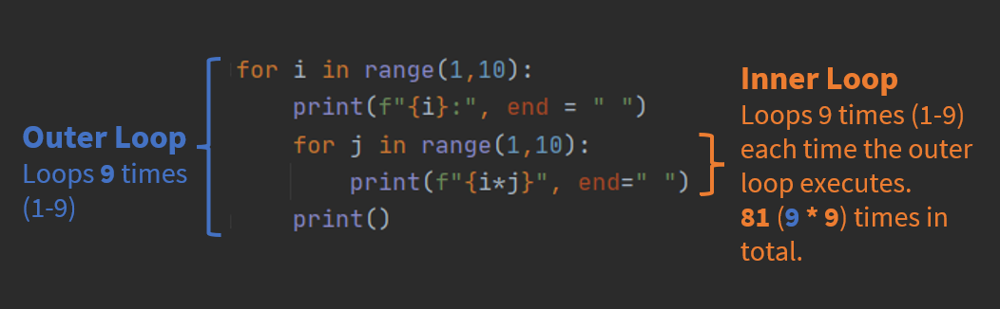

## Table of Contents
1. [Lists & Loops](#list_and_loop)
2. [In-class exercise](#exercise)
3. [Ranges](#ranges)
4. [Nested Loops](#nested_loops)
5. [Tuples](#tuples)

## Lists & Loops <a name="list_and_loop"></a>

### Navigating Lists
It's not always convenient to manipulate lists by specifying exactly which one element at a time we would like to use.

For example, if we wanted to multiply each of the numbers in a list by 2 this way, we'd need a new line of code for each element in the list:

```python
list_of_numbers = [15, 22, 38, 54, 66, 3]

print(f"Double the element at position 0 in list_of numbers is {list_of_numbers[0] * 2}")
print(f"Double the element at position 1 in list_of numbers is {list_of_numbers[1] * 2}")
print(f"Double the element at position 2 in list_of numbers is {list_of_numbers[2] * 2}")
# AND SO ON
```

Similarily, in the in-class exercise last week we did something like this:

```python
# Create lists of patients first and last names and birth years
first_name = ['Edgar', 'Dionna', 'Eleni', 'Ricardo', 'Michelle']
last_name = ['Hermann', 'Heathcote', 'Gusikowski', 'Mills', 'Breitenberg']
birth_year = [1989, 2018, 2013, 2011, 1969]

# print out information about the second patient
print(f'{first_name[1]} {last_name[1]} was born in {birth_year[1]}')
```

Which prints:
```
Dionna Heathcote was born in 2018
```

If we wanted to print all the patient information we would need to do something like this:
```python
# print all patients information
print(f'{first_name[0]} {last_name[0]} was born in {birth_year[0]}')
print(f'{first_name[1]} {last_name[1]} was born in {birth_year[1]}')
print(f'{first_name[2]} {last_name[2]} was born in {birth_year[2]}')
print(f'{first_name[3]} {last_name[3]} was born in {birth_year[3]}')
print(f'{first_name[4]} {last_name[4]} was born in {birth_year[4]}')
```

This could be really tedious and it would also make it hard to generalize the code to work on lists of any size (imagine if the lists had a **million** entries instead of five).

Programming should be about making our lives less tedious and help us deal with large amounts of information all at once. 
### What is a loop?
A **loop** allows you to repeat a block of code multiple times. 

Loops are useful for:
1. Automating repetitive tasks
2. Processing collections of items

Now, let's look at how we can use a **loop** to do something with every element of a list.
### For loop
We will often use **for** loops to do something with all the elements of a list. Here's a simple example that prints the elements of the list one by one:

```python
for n in list_of_numbers:
    print(n)
```

And this example multiplies each element by 2, printing that value.

```python
for n in list_of_numbers:
    print(n * 2)
```

Let's check in and see whether any of this has changed our list:

```python
print(list_of_numbers)
```

That didn't change our list, and it doesn't seem to have stored the doubled values anywhere.

### For loop syntax
```python
for <variable> in <list>:
	<do something>
```

### Append

If we wanted to make a new list with the doubled values, here's one way of doing that:

```python
new_list_of_numbers = []
for n in list_of_numbers:
    new_list_of_numbers.append(n*2)
print(f"All values in new_list_of_numbers: {new_list_of_numbers}")
```

In this snippet of code the third line is *inside* the loop -- it's something that will be done however many times the loop runs. The print statement on the last line of this snippet is *not* inside the loop, it runs after the loop is totally finished.

> **Question:** How many times did this loop run?
### Loop "scope"

Let's look at what it would look like if that print statement were inside the loop:

```python
new_list_of_numbers = []
for n in list_of_numbers:
    new_list_of_numbers.append(n*2)
    print(f"All values in new_list_of_numbers: {new_list_of_numbers}")
```


Note the difference in behavior between this example and the previous one. **Whether a line of code is inside a loop or outside a loop makes a big difference.**

Python uses indentation ("whitespace") to keep track of what is inside a loop (and similar structures). Some other programming languages use explicit markers for this, like '{' and '}' to mark the beginning and end of a loop body.

What's wrong with this code?

```python
for n in list_of_numbers
    print(n * 2)
```

### List indices in loops

In the example that kicked off this section, we pointed out how tedious (and in some cases impossible) it would be to write out a new print statement for each element in a list:

```python
print(f"Double the element at position 0 in list_of numbers is {list_of_numbers[0] * 2}")
print(f"Double the element at position 1 in list_of numbers is {list_of_numbers[1] * 2}")
print(f"Double the element at position 2 in list_of numbers is {list_of_numbers[2] * 2}")
# AND SO ON
```

You will notice that our loop examples so far are not exactly duplicating this behavior because they're not printing out a message that includes the **index/number** of each element.
We could get that information using the **enumerate** function:

```python
for i, n in enumerate(list_of_numbers):
    print(i)
    print(n)
```

So, putting these together we get:

```python
for i, n in enumerate(list_of_numbers):
    print(f"Double the element at position {i} in list_of numbers is {list_of_numbers[i] * 2}")
```
### List of Lists

So far the example lists we've looked at have been sequences of relatively simple elements like ints and strings. We've also seen that we can mix types of elements within a list.
You may not have realized we can also put lists inside of lists:

```python
bootcamp_teachers = [["Jonathan", "Bona", "Assistant Professor", "Biomedical Informatics"], ["Cody", "Ashby", "Assistant Professor", "Biomedical Informatics"], ["Shaymaa", "Al-Shukri", "Instructor", "Biomedical Informatics"]]
```

We could imagine building up a kind of "database" this way. There are a few reasons we wouldn't do this with lists of lists in practice, but it's definitely the sort of thing you should play around with you as learn to navigate lists.

One of the limitations of this approach is that we're just relying on the order of elements within these lists to keep track of what kind of information is in them: first name is stored at index 0 in each list, last name is stored at index 1, etc. One of the data types we'll look at next week (**dict**) allows us to make this information more explicit.

Anyway, how many elements are in **bootcamp_teachers**?

Here's a loop that prints out just the last names and job titles:

```python
for bt in bootcamp_teachers:
    print(f"{bt[1]} is an {bt[2]}")
```

## 2025 Summer Python Programming Bootcamp - In-class Exercise 2 <a name="exercise"></a>
========
### Exercise
This exercise continues on from the exercise at the end of last session.

As a reminder, let's say we have some patient demographic data from an electronic health record stored in a tabular format, where each row in the table has information for a single patient, and each column in the table has a distinct feature of the patient's record. For example, in the table below the first row is about a patient named Edgar Hermann. The first column in the table holds MRNs (medical record numbers); the last column holds patients' heart rate in beats per second; and so on.

**NOTE** This is made up ("synthetic") example data. These are not real people, social security numbers, etc.

| MRN  | BIRTHYEAR | SSN         | FIRST    | LAST        | ZIP   | HR_BPS |
| ---- | --------- | ----------- | -------- | ----------- | ----- | ------ |
| 7182 | 1989      | 999-76-5071 | Edgar    | Hermann     | 72034 | 1.1    |
| 7491 | 2018      | 999-92-3312 | Dionna   | Heathcote   | 72411 | 1.4    |
| 7052 | 2013      | 999-80-4418 | Eleni    | Gusikowski  | 72736 | 1.9    |
| 4851 | 2011      | 999-51-6410 | Ricardo  | Mills       | 72046 | 1.3    |
| 1744 | 1969      | 999-72-5953 | Michelle | Breitenberg | 72472 | 1.6    |

#### **Task 1**: Make a list of lists
As we did this last session, the code to generate the list of lists with all entries is provided below:
```python
patients = [[7182,1989,"999-76-5071","Edgar","Hermann",72034, 1.1],
           [7491,2018,"999-92-3312","Dionna","Heathcote",72411, 1.4],
           [7052,2013,"999-80-4418","Eleni","Gusikowski",72736, 1.9],
           [4851,2011,"999-51-6410","Ricardo","Mills",72046, 1.3],
           [1744,1969,"999-72-5953","Michelle","Breitenberg",72472, 1.6]]
```
#### **Task 2**: Print out the list using a loop
Write a loop using **for** that prints each patient's name and age in years.
For example, the loop should start by printing something like the following:

```
Edgar Hermann was born in 1989 and is at least 35 years old.
Dionna Heathcode was born in ...
```

#### **Task 3**: Add a new patient to patients
Write code to add the following new patient to patients.

| MRN | BIRTHYEAR | SSN | FIRST | LAST | ZIP | HR_BPS|
| -----| -----| -----| -----| -----| -----| -----|
| 3192 | 1980| 999-71-0401 | Ridley | McGuffin | 72450 | 2.1|

After adding this patient, print each patient's name and age in years again to confirm you've added the new patient.

#### **Task 4:** Print the patient's BPM
Perhaps you've noticed that there is a new variable added to the table since last time. The patient's heart rate (stored in column HR_BPS). However, for some inscrutable reason, they've stored it as beats per **second** instead of the more commonly used beats per **minute**. Write code to display the patient's heart rate in beats per minute. 

Example output should be something like:
```
Edgar Hermann has a heart rate of 66.0 beats per minute.
Dionna Heathcode has a heart rate of ...
```

## Ranges <a name="ranges"></a>
Another type of sequence in python is the **range**. Ranges generate a series of numbers in sequence. For instance, if we want to get all the numbers up to 10:

```python
print(range(10))
```

This doesn't actually look like much if we're used to looking at lists. We can always turn a range into a list if that makes us more comfortable:

```python
print(list(range(10)))
```

But we don't have to turn a list into a range to use it. For instance, we might loop across a range and print out the values:

```python
for n in range(10):
    print(n)
```

Or to be slightly more interesting, we could use a range to print out the squares of consecutive numbers:
```python
for n in range(10):
    print(f'{n} squared is {n**2}')
```

Python picks 0 as the starting point for a range if we don't specify a starting point, but we can specify a start and end point as follows:
```python
for n in range(10,20):
    print(f'{n} squared is {n**2}')
```

## Nested Loops  <a name="nested_loops"></a>
Let's say that we want to display a multiplication table like so:
```python
1: 1 2 3 4 5 6 7 8 9 
2: 2 4 6 8 10 12 14 16 18 
3: 3 6 9 12 15 18 21 24 27 
4: 4 8 12 16 20 24 28 32 36 
5: 5 10 15 20 25 30 35 40 45 
6: 6 12 18 24 30 36 42 48 54 
7: 7 14 21 28 35 42 49 56 63 
8: 8 16 24 32 40 48 56 64 72 
9: 9 18 27 36 45 54 63 72 81
```

One way, using what we've learned so far would be like so:

```python
# print the multiples of 1
print("1:", end = " ")
for i in range(1,10):
    print(f"{i*1}", end = " ")
print()
#print the multiples of 2
print("2:", end = " ")
for i in range(1,10):
    print(f"{i*2}", end = " ")
print()

...

#print the multiples of 9
print("9:", end = " ")
for i in range(1,10):
    print(f"{i*9}", end = " ")
print()
```

However, this could be really tedious and it would also make it hard to generalize the code.

Instead, we can use **nested** loops. In other words, a loop within a loop.

```python
for i in range(1,10): # this loop has i go from 1-9
    print(f"{i}:", end = " ")
    for j in range(1,10): # this loop has j go from 1-9
        print(f"{i*j}", end=" ")
    print()
```
In this code we loop over the range of 1-10 (integers 1-9) in variable *i*. We also loop over the same range in variable *j*. We then loop and output *i* * *j*. For a visualization of what's happening see the figure below.



We can see that if we had done our first approach to output each number would take us 4 lines of code, so 9 numbers would have been 36 (4*9) lines of code. This accomplished the same thing in 5 lines of code. But, how many times did this loop? We could easily check using a variable that increments whenever we loop.

```python
loop_count = 0
for i in range(1,10): # this loop has i go from 1-9
    for j in range(1,10): # this loop has j go from 1-9
        loop_count = loop_count + 1
print(loop_count)
```

To see some of the potential of this, we could easily now output a multiplication table that goes from 1-100 instead of 1-9, without adding any new lines of code just by changing our ranges.

```python
for i in range(1,101): #changed the range to go 1-100
    print(f"{i}:", end = " ")
    for j in range(1,101): #changed the range to go 1-100
        print(f"{i*j}", end=" ")
    print()
```

We can use the same logic as before to see that using our first approach to do this would take 400 lines of code (4 * 100). We're still using the same 5 lines of code with adjusting ranges, but how many times did it loop?

```python
loop_count = 0
for i in range(1,101): # this loop has i go from 1-100
    for j in range(1,101): # this loop has j go from 1-100
        loop_count = loop_count + 1
print(loop_count)
```

**Note:** You could also have a loop within a loop within a loop and so on. However, too many nests in a loop can impact performance on large datasets.

## While Loops

*While* loops in Python are an alternative to **for** loops. They're used for repeating a block of code as long as a specified condition is true. They are useful when the number of iterations is not known in advance.

The basic structure is

```python
while (condition is true): 
  <your code>
```

This means that the section of *your code* is going to run and do something with the *flag* and go back to check the *condition*, and run *your code* again and once completed goes back and check the *condition* and so on.

```python
n = 1  # This is your counter (or flag)
while n <= 10:
    print(n)
    n = n + 1    # Updating the counter to eventually end the loop
```

This loop prints numbers from 1 to 10. The counter `n` starts at 1 and increments by 1 on each iteration. The loop stops when `n` becomes greater than 10.

You can also, combine them with `if` statements, for instance:
  
```python
n = 1  # This is your flag (or in this case counter)
while n <= 10:
    n = n + 1    # you modify your flag
    if n>5:
        print(n)
```

Now, this will print the numbers 6 to 10.

How is that different than the following:

```python
n = 1  # This is your flag (or in this case counter)
while n <= 10:
    if n>5:
        print(n)
    n = n + 1    # you modify your flag
```

### WARNING: Avoid Infinite Loops!

One word of caution: *while* loops can create easily **infinite loops**, where the condition never becomes false:

```python
### DO NOT RUN THIS CODE
while 1:
  print(f"Sorry computer...")
```

### Break statement
  
The *break* statement inside the loop will stop the iteration, regardless of the loop's condition.
  
```python
n = 1  # This is your flag (or counter)
while n <= 1000000:
    print(n)
    n = n + 1    # you modify your flag
    if n>5:
	    break
```

### Continue statement

The `continue` statement skips the rest of the code inside the loop for the current iteration and proceeds with the next iteration. You can think of this as going back to the top of the loop, and skipping the rest of it. 

> Both *break* and *continue* can be used in *for* and *while* loops.

For example:

```python
n = 1  
while n <=1000:  
    n = n + 1  
    if n <= 10:  
        continue  
    elif n >= 20:  
        break  
    print(f"{n}")
```    

This code (which is obviously *contrived*) demonstrates printing the numbers 11 to 19. The `continue` statement skips printing numbers from 1 to 10, and the `break` statement stops the loop after printing 19.

### Nested While Loops
Like `for` loops, we can also nest while loops. For example:
```python
i = 1
while i <= 3:
    j = 1
    while j <= 3:
        print(f"i = {i}, j = {j}")
        j += 1
    i += 1
```

### Why use `while` loops?
As mentioned you would use a while loop instead of a for loop when you **don't know in advance how many times the loop should run**.

Some examples are:
- A program that runs until the user types the word 'quit'.
- A program that runs until a file exists.

> For the scope of this bootcamp, most of the time you probably won't use `while` loops.

## Tuples
Another type of sequence we will sometimes want to use in Python is the **tuple**.

```python
my_tuple = (2023, "July", 12.02)
```
### Tuples are immutable
Like **strings**, and unlike lists, tuples are **immutable** -- we can't change the contents of a tuple.

This will generate an error because we can't change what's stored in a string:

```python
variants_str = "alpha, Beta, Gamma, Delta"
print(f"The first element in the string variants_str is: {variants_str[0]}")
variants_str[0] = 'A'
```

This works fine because we can change lists:

```python
variants_list = ['alpha', 'Beta', 'Gamma', 'Delta']
print(f"The first element in the list variants_list is: {variants_list[0]}")
variants_list[0] = 'Alpha'   # change the first value in the list -- works fine!
variants_list.append('Epsilon')
```

This will generate an error because we can't change what's stored in a tuple:

```python
variants_tuple = ('alpha', 'Beta', 'Gamma', 'Delta')
print(f"The first element in the tuple variants_tuple is: {variants_tuple[0]}")
variants_tuple[0] = 'Alpha'     # error -- we can't change a tuple!
variants_tuple.append('Epsilon')
```

However, just as with strings, although we cannot change the underlying object (string or tuple) stored in a variable, we can re-assign the variable so that it has a new object:

```python
variants_str = "alpha, Beta, Gamma, Delta"
print(f"The first element in the string variants_str is: {variants_str[0]}")
variants_str = "Alpha, Beta, Gamma, Delta"
print(f"The first element in the string variants_str is now: {variants_str[0]}")
```

```python
variants_tuple = ('alpha', 'Beta', 'Gamma', 'Delta')
print(f"The first element in the tuple variants_tuple is: {variants_tuple[0]}")
variants_tuple = ('Alpha', 'Beta', 'Gamma', 'Delta', 'Epsilon')
print(f"The first element in the tuple variants_tuple is: {variants_tuple[0]}")
```

### Accessing tuple elements
As seen above, we can access the elements of a tuple using '[' and ']' with an index, just like with any other sequence.

We can also slice them:

```python
print(f"Elements after the first element in the tuple variants_tuple are: {variants_tuple[1:]}")
```

And we can use a loop to iterate over all the elements:

```python
for v in variants_tuple:
    print(f'This variant is: {v}, but in upper case it is:{v.upper()}')
```

