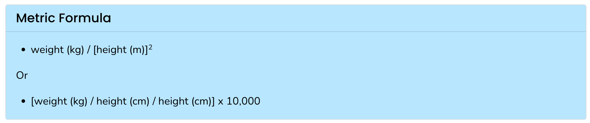

# Functions

## Intro

As we discussed when looking at the _is\_sorted_ example 
at the start of class, it is often very useful to write a 
few (or many) lines of code that, in combination, accomplish 
some particular task. 

In Python, as in many other programming languages, we can define _functions_
that allow us to bundle together the to perform a task in a single place, 
give it a name, and use it repeatedly without writing out the 
same code over and over again.

**We want to avoid having to write duplicate code like the following:**

```python

alist = [109, 230, 388, 1005, 9, 5, 1999, -3.14]
found_it = False       # this will keep track of whether we've yet seen anything out of order
for i in range(len(alist) - 1):
    if alist[i] > alist[i+1]:
        found_it = True
        print(f" {alist[i]} and  {alist[i + 1]} are out of order, so STOP!")
        break

# after
if found_it:
    print("The list was NOT in order")
else:
    print("The list WAS in order")


alist2 = [109, 230, 388, 1005, 9000]
found_it = False       # this will keep track of whether we've yet seen anything out of order
for i in range(len(alist2) - 1):
    if alist2[i] > alist2[i+1]:
        found_it = True
        print(f" {alist2[i]} and  {alist2[i + 1]} are out of order, so STOP!")
        break

# after
if found_it:
    print("The list was NOT in order")
else:
    print("The list WAS in order")
```

Any time we have two sections of code that do the same thing (or nearly the same thing), we should be thinking about turning them into a function. 

Avoiding code duplication is not just more convenient, it also helps us avoid making errors


We have already been using some functions, for instance the function 
[_len()_](https://docs.python.org/3/library/functions.html#len) 
gets the length of a sequence if we put a sequence between its parentheses.

```python
print(len("This is a string, a kind of sequence"))
```

this outputs:

```
36
```

In this example, we are _calling_ (using) the function _len()_, and we are 
_passing_ it as its  _argument_ a string.

In just a moment we'll take a look at how to define our own functions, 
and how to specify what arguments they accept and what they do with them.

Note also that _len()_ _returns_ a value. That means we can put code 
that calls _len()_ on the right hand side of an assignment statement,
and thereby capture the value it returns and store it in a variable:

```python
x = len("This is a string, a kind of sequence")
print(x)
```

Some functions do not return useful values. _print_ is one such function:

```python
x = print("This is a string")
```

Is this assignment statement valid Python code? If yes, what kind of 
value does _x_ have after this?

Watch out, **returning a value** vs **outputting a value** is one of the key distinctions in Python that can be tricky for beginners.

## Functions vs Methods

We've already talked a bit about _methods_, which are similar to functions in many ways.

One of several methods we've used/seen is the _isupper()_ method for strings:

```python
print("Is this string all in upper case?".isupper())
```

We won't have a chance to talk about defining your own methods, so this distinction may remain a bit of a mystery to you for now. 

## Defining a function

If we want to create our own function, we do that using the **_def_ keyword**, 
followed by a **name for the function**, followed by **open and closing parentheses**, 
followed by a **colon**:

```python
def say_hello():
    """This is a pretty useless simple function that just says hello"""
    print("Hello, students!")
```

+ The **name** can be whatever we want it to be
    + **subject to the same rules** we've seen earlier for naming variables. 
    + It should be **meaningful** to **us** if possible as well!

+ Function Parts:
    + function **header** 
        + the line starting with def
            + *def* tells Python we're starting a function definition
            + the function *name* (here *say\_hello*), which we will use when we want to use the function
    + **documentation string** 
        + this is optional
        + if included, this should say what the function does
    + function **_body_**
        + the code we want the function to execute when we use it
        + note the indentation! 

**Note**: The function doesn't actually perform its defined task until we use it. 
The function definition describes what steps Python should perform *when we use the function*.

We "call" (use) the function by putting its name followed by empty parentheses:

```python
say_hello()
```

## Parameters / Arguments
One of the main reasons to create a function is to generalize and name some behavior so it can 
be applied to different objects.

For example, if we are writing code to figure out whether a sequence is sorted, we 
would ideally be able to use that code on any sequence -- not just on
one sequence stored in a particular variable in our program. We'll get to that example 
in a moment.

The following defines a function called _say\_hello2_ that will accept a single 
argument when it is used. When we are talking about the function definition,
we will usually call _things accepted by the function_ "parameters". So this 
function accepts a single parameter called "name".
We can think of *name* here as being like a variable that only exists within the function. It won't have a value attached to it until we use the function.

```python
def say_hello_simple(name):
    """This function uses a parameter, which is called 'name'"""
    print(f"Hello, {name}!")
```

When we use this function, we need to give it something between the parentheses because our function definition requires a single parameter (_name_):

```python
say_hello_simple()
```

That doesn't work because it's expecting an argument.

```python
say_hello_simple("Python Students")
```

Here we pass it a string as its argument, and the function will print out a 
message using that string.

### Multi-Parameter

In the most simple case, a function needs exactly as many arguments as it has 
parameters, and the arguments given when we call the function
are assigned, in order, to the parameters in the function definition. Here's a 
function with three parameters (and no documentation string, by the way):

```python
def say_hello_multi(class_name, first_name, last_name):
    print(f"Hello, {class_name} from {first_name} {last_name}")
```


When we call (use) this function, we need to give it three arguments:

```python
say_hello_multi("Python Bootcamp", "Jonathan", "Bona")
```

What happens if we don't give the function values for all three parameters?

```python
say_hello_multi("Python Bootcamp")
```


### Default Parameters

Python does allow us to specify default values for our parameters. 
If we do this, and then call the function without providing arguments
for those parameters, Python will just use the defaults instead.

```python
def say_hello_multi_default(class_name, first_name="Jonathan", last_name="Bona"):
    print(f"Hello, {class_name} from {first_name} {last_name}")
```

What do each of these do?

```python
say_hello_multi_default("Python bootcamp")
```

```python
say_hello_multi_default("Python bootcamp", "Jonathan", "Bona")
```

## Positional vs Keyword Arguments

When we call a function, we can specify the arguments in two ways:

**Positional** arguments

+ The arguments are assigned to the parameters in the order they are given

```python
say_hello_multi_default("Python bootcamp", "Jonathan", "Bona")
```

See what happens if we mix up the variables:

```python
say_hello_multi_default("Jonathan", "Bona", "Python bootcamp")
```

**Keyword** arguments

+ The arguments are assigned to the parameters based on the name of the parameter

```python
say_hello_multi_default(first_name="Jonathan", last_name="Bona", class_name="Python bootcamp")
```

## A non-trivial example


Here is a function that defines the _is\_sorted_ behavior we discussed previously:

```python
def is_sorted(a_list):
    out_of_order = False
    for i in range(len(a_list) - 1):
        if a_list[i] > a_list[i + 1]:
            print(f"In {a_list}, {a_list[i]} was greater than {a_list[i + 1]}, so this list is not sorted!")
            out_of_order = True
            break
    if not out_of_order:
        print(f"At the end of {a_list}, no pairs are out of order, the list is sorted.")
```

Test it out:

```python
is_sorted([3, 2, 0])
```


```python
is_sorted([0, 5, 9])
```

Let's make some lists and try them out:

```python
unordered_numbers = [3, 4, 6, 1, 8, 2, 9, 7, 5]
ordered_numbers = [1, 2, 3, 4, 5, 6, 7, 8, 9]
```

```python
is_sorted(unordered_numbers)
```

```python
is_sorted(ordered_numbers)
```


This code makes a list of ten randomly selected numbers less than 20. It also uses 
an import statement to let us use functions from the _random_ module that is included 
with Python:

```python
import random
randlist = random.sample(range(20), 10)
print(randlist)
```

```python
is_sorted(randlist)
```

Defining a function to carry out this task is much more convenient than copying, 
pasting, and editing the same code over and over again to repeat the task!


## Exercise
Let's develop a function to calculate and output a person's Body Mass Index.
According to the CDC, here's [how to calculate BMI from metric measurements of height and weight](https://www.cdc.gov/nccdphp/dnpao/growthcharts/training/bmiage/page5_1.html):



### Part 1
Write a python function named *print_bmi* that accepts two parameters: one for a person's weight in kilograms, and one for a person's height in centimeters. The function should calculate the person's BMI and output a message.
For example:

```python
print_bmi(95, 190)
```

Should output a message like:

```python
The BMI for a person who is 190 cm tall and weight 95 kg is: 26
```

Note: you might get a value more like *26.31578947368421*. That's okay. We'll fix it later.

### Part 2
Use your function with the following dict to calculate the BMI for Edgar Hermann

```python
pat1 = {'mrn': 7182, 
        'birthyear': 1989, 
        'fname': 'Edgar', 
        'lname': 'Hermann', 
        'zip': 72034, 
        'height_cm': 164.5, 
        'weight_kg': 82.7}
```

Hold on to this function, as we'll modify it in a later exercise.

## Watch out for mutability!

In general it's a good idea to avoid making any changes to what is stored in 
your parameters within a function. Sometimes such changes will persist even 
outside the function!


Here's an example where it doesn't do any harm:

```python
def change_a_number(num):
    print(f"\tIn function - before change: You passed in the number: {num}")
    num = num * num
    print(f"\tIn function - after change: We changed the number: {num}")
```

```python
change_num = 5
print(f"Before function. You are passing the number: {change_num}")
change_a_number(change_num)
print(f"After function. The number in the variable is: {change_num}")
```

And here's an example where it could really mess up someone's day:

```python
def change_a_list(a_list):
    print(f"\tIn function - before change. You passed in the list: {a_list}")
    a_list.extend(["mutability", "is", "a", "liability"])
    print(f"\tIn function - after change. We changed the list: {a_list}")
```

```python
change_list = ["Don't", "change", "parameters", "in", "functions"]
print(f"Before function. You are passing the list: {change_list}")
change_a_list(change_list)
print(f"After function. The list in the variable is: {change_list}")
```


Because lists are mutable, changes to the list parameter within the function 
_change\_a\_list_ are also changes to the original list that we passed as an 
argument! One way of describing this situation is to say that the function 
_has side effects_.

Sometimes this kind of behavior can be helpful, but more often than not it can 
lead to bugs.

Here's an example of a built-in Python method that does this on purpose:


```python
permanently_sort_this = [9, 6, 1, 4]
permanently_sort_this.sort()
print(permanently_sort_this)
```


## Returning a value

Recall that some functions _return_ a value and some do not. This is a key feature 
in some functions -- the _len()_ function would be much less useful if it didn't
give us back a value we can use in further calculations.

So far the functions we've created have not returned values. Let's look at how 
to return values from a function.


```python
def square_it(n):
    """Given a number, return its square"""
    return n**2
```

When we give this function a number as its argument, it will return the square 
of that number:

```python
print(square_it(45))
```

The _return_ statement in this function does two things: 

+ it causes the function to stop running (think of *break*)
+ and it causes the function to return whatever value comes after the keyword _return_.

"Causes the function to stop running" may seem like an odd thing to say here 
because the return statement is the last line of code in the function's body, 
so the function was going to stop running after that anyway. Let's take a look 
at an example with a loop:


```python
def square_some(a_list):
    for n in a_list:
        if n ** 2 > 20:
            return n
```

What will this return?

```python
square_some([1, 2, 3, 4, 5, 6])
```

Here is our original is_sorted function:

```python
def is_sorted(a_list):
    out_of_order = False
    for i in range(len(a_list) - 1):
        if a_list[i] > a_list[i + 1]:
            print(f"In {a_list}, {a_list[i]} was greater than {a_list[i + 1]}, so this list is not sorted!")
            out_of_order = True
            break
    if not out_of_order:
        print(f"At the end of {a_list}, no pairs are out of order, the list is sorted.")
```

That version prints out a message telling us whether the list is sorted, but it doesn't *return* an answer that the rest of the Python program could use.

Let's make a version of _is\_sorted_ that actually returns an answer (True or False):

**NOTE: this version was broken in class on July 24, 2025 due to a subtle issue with the indentation**.
It *should* be fixed here, but please pay attention to warnings in PyCharm about inconsistent indentation when you copy blocks of code from these notes!!

```python
def is_sorted(a_list):
    out_of_order = False
    for i in range(len(a_list) - 1):
        if a_list[i] > a_list[i + 1]:
            out_of_order = True
            break
    return not out_of_order
```


Let's try it


```python
unordered_numbers = [3, 4, 6, 1, 8, 2, 9, 7, 5]
ordered_numbers = [1, 2, 3, 4, 5, 6, 7, 8, 9]
```

```python
is_sorted(unordered_numbers)
```

```python
is_sorted(ordered_numbers)
```


```python
import random
randlist = random.sample(range(20), 10)
print(randlist)
```


We can even make a slightly simpler version of *is\_sorted*:


```python
def is_sorted(a_list):
    for i in range(len(a_list) - 1):
        if a_list[i] > a_list[i + 1]:
            return False
    return True
```

Will this work?


# Exercise


## Part 0 - Data
Use the following dict and list of dicts


```python
pat1 = {'mrn': 7182,
        'birthyear': 1989,
        'fname': 'Edgar',
        'lname': 'Hermann',
        'zip': 72034,
        'height_cm': 164.5,
        'weight_kg': 82.7}
```

```python

patlist = [{'mrn': 7182, 'birthyear': 1989, 
            'fname': 'Edgar', 'lname': 'Hermann', 
            'zip': 72034, 'height_cm': 164.5, 'weight_kg': 82.7},
           {'mrn': 7491, 'birthyear': 2018, 
            'fname': 'Dionna', 'lname': 'Heathcote', 
            'zip': 72411, 'height_cm': 191.0, 'weight_kg': 59.2},
           {'mrn': 7052, 'birthyear': 2013, 
            'fname': 'Eleni', 'lname': 'Gusikowski', 
            'zip': 72736, 'height_cm': 179.1, 'weight_kg': 85.3},
           {'mrn': 4851, 'birthyear': 2011, 
            'fname': 'Ricardo', 'lname': 'Mills', 
            'zip': 72046, 'height_cm': 175.1, 'weight_kg': 59.4},
           {'mrn': 1744, 'birthyear': 1969, 
            'fname': 'Michelle', 'lname': 'Breitenberg', 
            'zip': 72472, 'height_cm': 153.1, 'weight_kg': 93.8}]
```


## Part 1 - Return a value
Write a new function called *calulate\_bmi* that is like *print\_bmi*, but instead of printing the BMI as output,  *calulate\_bmi* should simply return the calculated value.

Verify that this function is working (hint: how can you call the function and print the value it returns?)


## Part 2 - Calculate all patient BMIs
Using a for loop, print out each patient's name and BMI, with one line of output per patient:


```python
Edgar Hermann has a BMI of 30
Dionna Heathcote has a BMI of 16
Eleni Gusikowski has a BMI of 26
Ricardo Mills has a BMI of 19
Michelle Breitenberg has a BMI of 40
```

## Bonus
The *floor* function in Python's *math* library can be used to round a number down to the nearest whole number:

```python 
import math

print(math.floor(2.718281828459045)) # outputs 2

```

Modify your *calulate\_bmi* function so that it returns a rounded-down value for BMI.

